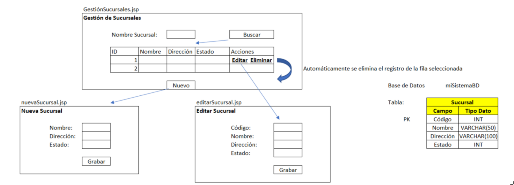
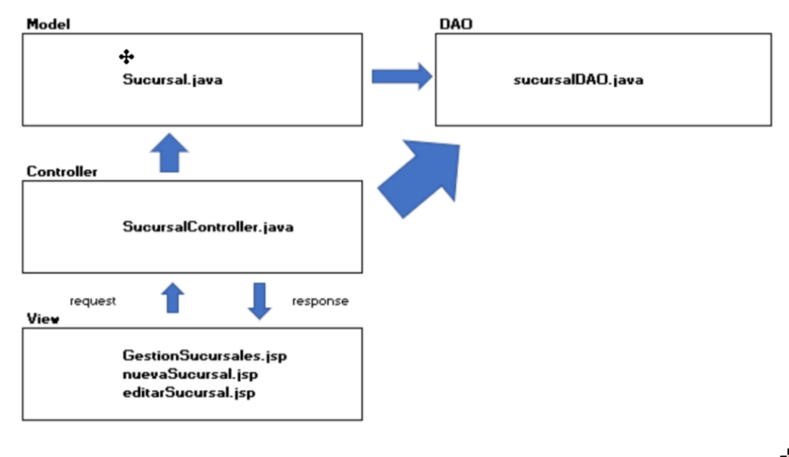

> Made by: Julisa Leon Corrales


# Installing utilites

## Java and friends

### Installing java


```bash
sudo dnf update
sudo dnf install java-21-openjdk-devel
```

Test java
```bash
java -version
```

you should see:

```
openjdk version "21.0.4" 2024-07-16
OpenJDK Runtime Environment (build 21.0.4+7)
OpenJDK 64-Bit Server VM (build 21.0.4+7, mixed mode, sharing)
```

If not, try to modify your bash source: 

```bash
code ~/.bashrc
```

And insert the following lines: 

```bash
export JAVA_HOME=/usr/lib/jvm/java-21-openjdk
export PATH=$JAVA_HOME/bin:$PATH
```

Then, run 
```bash
source ~/.bashrc
```


### Installing friends


#### Maven

```
dnf install maven
```

check: 


```bash
mvn -v
```

Expected 
```
Apache Maven 3.9.9 (8e8579a9e76f7d015ee5ec7bfcdc97d260186937)
Maven home: /usr/share/java/maven
Java version: 21.0.4, vendor: Arch Linux, runtime: /usr/lib/jvm/java-21-openjdk
Default locale: en_US, platform encoding: UTF-8
OS name: "linux", version: "6.10.10-arch1-1", arch: "amd64", family: "unix"
```

#### Tomcat

THis is kinda long, but just follow my lead, love of mine

1. First, download the packed tomcat installation

```bash
wget https://downloads.apache.org/tomcat/tomcat-9/v9.0.95/bin/apache-tomcat-9.0.95.tar.gz
```

Wait until it completes, you should see a file named `apache-tomcat-9.0.95.tar.gz` on the same folder you executed that cmd

2. Then, tar (unpack) the file

```bash
tar -xvzf apache-tomcat-9.0.95.tar.gz
```

3. Move the installation to the apps folder  
```bash
sudo mv apache-tomcat-9.0.95 /opt/tomcat
```

4. Edit your bash file: 


```bash
code ~/.bashrc
```

Add the following lines:

```bash
export CATALINA_HOME=/opt/tomcat
export PATH=$CATALINA_HOME/bin:$PATH
```

Reload
```bash
source ~/.bashrc
```

5. Test your tomcat installation: 

navigate to 
```bash
cd /opt/tomcat/bin
```

And run tomcat:
```bash
./startup.sh
```

Then, open in your browser `http://localhost:8080`

you should se THE CAT


Now your system is ready to run, my bububu!  


# Testing this code 


ASi como tu tienes tu `npm run start`, en java los abuelitos tienen `mvn clean package`, correlo cada vez que quieras probar algun cambio

Luego, tienes que mover tu archivo .war a tomcat:

```bash
sudo mv target/ISILRegalosERP-0.0.1-SNAPSHOT.war /opt/tomcat/webapps
```

Y tienes que reinicar al gateto: 
```bash
cd /opt/tomcat/bin
./shutdown.sh
./startup.sh
```

Te recomiendo que tengas una terminal dividad, en una la ruta de tu proyecto y en otra la del gateto


# What you have to do: 

## Caso – Análisis y Diseño de Sistemas

La empresa **ISIL SOFT S.A.C** se encuentra desarrollando un proyecto web utilizando como lenguaje de programación **JAVA** y una base de datos **SQL SERVER** para una empresa familiar que está abriendo su negocio de compra y venta de artículos de oficina y útiles escolares.

A continuación, se presenta un extracto de las necesidades presentadas por el cliente. 

“Somos una familia que se encuentra evaluando la opción de abrir una empresa relacionada al negocio de la compra y venta de artículos de oficina y útiles escolares”. Para ello la familia se encuentra realizando un estudio del mercado para ver si la empresa tendría un buen futuro. Adicional al estudio del mercado, propusieron algunas ideas sobre los procesos de negocio que manejarían y uno de ellos ha precisado lo siguiente:

La empresa iniciará con una sucursal que se abrirá cerca a la casa de la familia, posterior a ello se espera que se habrán 2 o 3 sucursales más en el mismo distrito en el primer año y 1 o 2 sucursales en diferentes distritos durante el segundo año.”

Producto de esta solicitud, el analista funcional y el arquitecto de software plantearon implementar el proyecto utilizando una aplicación web JAVA, bajo el modelo MVC (Model, View, Controller), con una base de datos **SQL Server** y utilizando el **patrón DAO**. Como parte del análisis y diseño se definió lo siguiente para la funcionalidad relacionada a la Gestión de Sucursales:



La imagen que has proporcionado muestra un diagrama que representa la interfaz de usuario y el diseño de la base de datos para la funcionalidad de Gestión de Sucursales en una aplicación web. Aquí tienes una descripción detallada considerando el contexto de la empresa familiar que planea abrir una tienda de artículos de oficina y útiles escolares:

>  Descripción de la Imagen

- Interfaz de Gestión de Sucursales (GestiónSucursales.jsp):
    - Columnas: ID, Nombre, Dirección, Estado y Acciones.
    - Acciones: Opciones para Editar y Eliminar.
    - Barra de Búsqueda: Permite buscar sucursales específicas.
    - Nota: Al seleccionar un ítem, se elimina automáticamente el registro de la base de datos.
- Interfaz para Nueva Sucursal (nuevaSucursal.jsp):
    - Campos: Nombre, Dirección y Estado.
    - Botón Grabar: Para guardar la información de la nueva sucursal.
- Interfaz para Editar Sucursal (editarSucursal.jsp):
    - Campos: Código, Nombre, Dirección y Estado.
- Estructura de la Base de Datos (SistemaBD):
    - Tabla Sucursal:
        - Campos:
            - Código (INT, PK)
            - Nombre (VARCHAR(100))
            - Dirección (VARCHAR(100))
            - Estado (INT)


### Arquitectura:

La imagen que has proporcionado muestra un diagrama que representa la estructura de una arquitectura Modelo-Vista-Controlador (MVC) en el diseño de software. Aquí tienes una descripción detallada considerando el contexto de la empresa familiar que planea abrir una tienda de artículos de oficina y útiles escolares:





## Descripción de la Imagen

### Modelo (Model):
- Sucursal.java: Representa la clase del modelo que contiene la lógica de negocio y los datos de las sucursales.

### DAO (Data Access Object):
- sucursalDAO.java: Clase que maneja la interacción con la base de datos, realizando operaciones CRUD (Crear, Leer, Actualizar, Eliminar) sobre las sucursales.

### Controlador (Controller):
- SucursalController.java: Clase que actúa como intermediario entre el modelo y la vista, gestionando las solicitudes del usuario y actualizando las vistas con los datos del modelo.

### Vista (View):
- gestionSucursales.jsp: Página JSP para la gestión de sucursales, mostrando una lista de sucursales con opciones para editar y eliminar.
- nuevaSucursal.jsp: Página JSP para agregar una nueva sucursal, con campos para ingresar el nombre, dirección y estado.
- editarSucursal.jsp: Página JSP para editar los detalles de una sucursal existente.

## Flujo de Interacción

### Solicitudes y Respuestas:
- El controlador recibe las solicitudes del usuario (request) y envía las respuestas (response) a las vistas correspondientes.

### Interacción Modelo-DAO:
- El modelo interactúa con el DAO para realizar operaciones en la base de datos.


### Task: 

Siguiendo el diseño y arquitectura presentado, se le pide que implemente un proyecto WEB en JAVA utilizando una base de datos SQL SERVER que permita dar solución a la funcionalidad de Gestión de Sucursales, considerando solo las funcionalidades de Buscar, Nuevo y Eliminar. Considere que el campo ID de la tabla debe ser un correlativo autogenerado.


### Evaluation: 


Debe tener en cuenta lo siguiente:

- Implementar los 2 jsp indicados (**6 puntos**)
    - GestiónSucursales.jsp (**3 puntos**)
    - NuevaSucursal.jsp (**3 puntos**)
- Implementar el archivo controller indicado (**7 puntos**)
- Implementar el archivo model indicado (**2 puntos**)
- Implementar el archivo DAO indicado (**4 puntos**).
- Script de la tabla Sucursal creada en la BD. (**1 punto**)


### Entregable: 

+ El código fuente del proyecto JAVA llamado SistemaLibreria.
+ El script SQL de la tabla Sucursal de la base de datos miSistemaBD.
+ Imágenes y/o video donde evidencie el funcionamiento de su aplicación (mostrar una búsqueda, un registrar, un editar y un eliminar).
+ El documento de la EP1 con su compromiso ético firmado.

> Debe entregar todo lo solicitado en un archivo .ZIP comprimido que tenga por nombre su Apellido Paterno y su Primer Nombre. Por ejemplo: ALLASI_DAVID.zip

